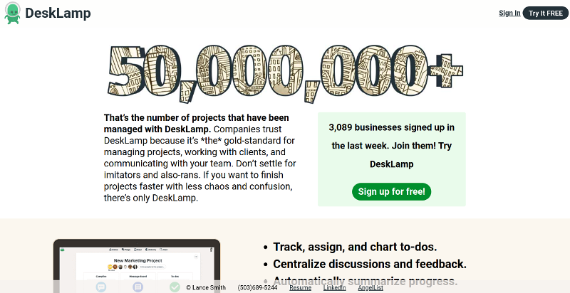
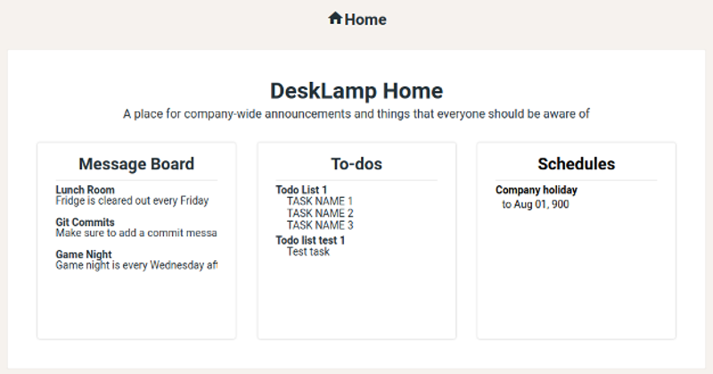

# DeskLamp

DeskLamp is an app for teams of people to track tasks and communicate across their company, team, or projects. It is modeled after the website Basecamp.
* DeskLamp provides users with a modular set of tools to manage tasks across all levels of a company



[DeskLamp Live](https://desklamp.herokuapp.com/)

## Technologies Used
### &nbsp;&nbsp;&nbsp;Backend
* Ruby on Rails was used for the Model and Controller part of MVC handling data from a Postgres database
* The Rails setup provided a lot functionality by default making it simple to build models with validations and assocations
* Jbuilder was used to build JSON responses that are being sent to the React / Redux frontend for rendering
* BCrypt is used to securely store user passwords by salting and hashing the passwords before saving them to the database

```
  attr_reader :password
  def password=(password)
    @password = password
    self.password_digest = BCrypt::Password.create(password)
  end

  def is_password?(password)
    BCrypt::Password.new(self.password_digest).is_password?(password)
  end

  def self.find_by_credentials(email, password)
    user = User.find_by(email: email)

    if user && user.is_password?(password)
      return user
    end
    return nil
  end

  def ensure_session_token
    self.session_token ||= generate_session_token
  end

  def reset_session_token
    self.session_token = generate_session_token
    self.save
    self.session_token
  end

  private
  def generate_session_token
    SecureRandom.urlsafe_base64(16)
  end
```

### &nbsp;&nbsp;&nbsp;Frontend
* React was used for building all of the views rendered in the browser
* Alongside React, Redux was used to manage the App's state
* Jbuilder made it easier to keep the state flat so complicated logic was not needed for retrieving data within the state

### &nbsp;&nbsp;&nbsp;Production
* DeskLamp is stored in a repository on GitHub and was deployed to Heroku for production

## How It Works
1. Users just need to click sign up to setup an account that requires a valid email, name, and password.
2. A company must be created t which will serve as the default landing page for a user. This then generates a default company hub.
3. From there the user will have access to all of the task tracking features. Like posting to a message board and creating to-do lists



## Challenges
* Linking Users to Organizations
  * I had to create a joins table linking users to organizations because they share a many-to-many relationship
  * When a user creates an organization the organization controller creates an entry in my joins table between the user and organization

## Future Additions
* The ability to create and edit existing companies and hubs within those companies
* Message Board within each hub to post messages anyone can see and comment on
* Todo lists within each hub that have tasks that can be created and completed
* Chat within each hub
* Upload files to a hub
* Schedule w/ calendar that can have events added at particular dates
* User profile pages for editing personal info and seeing other users' public info
